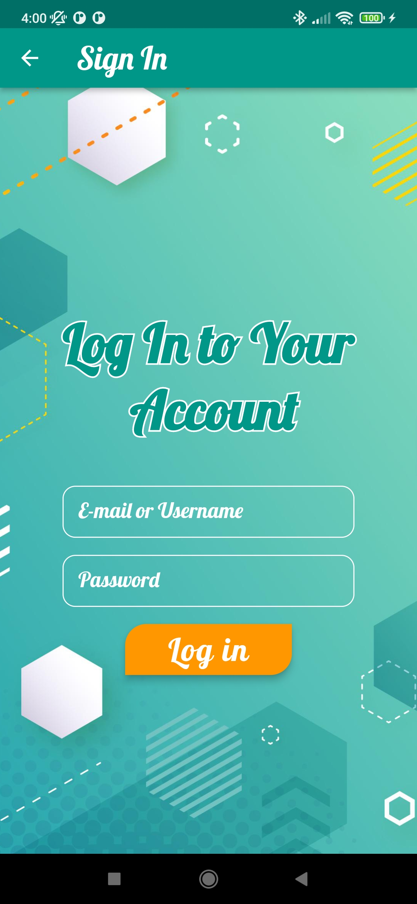
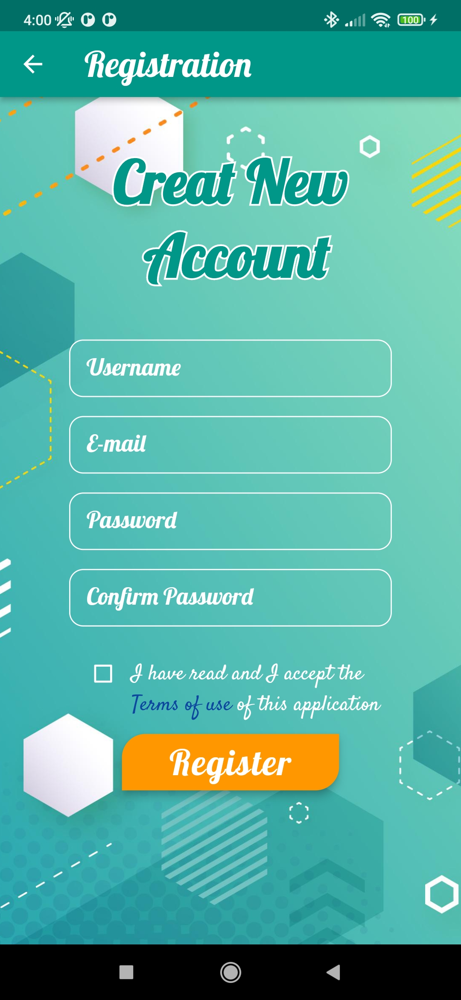
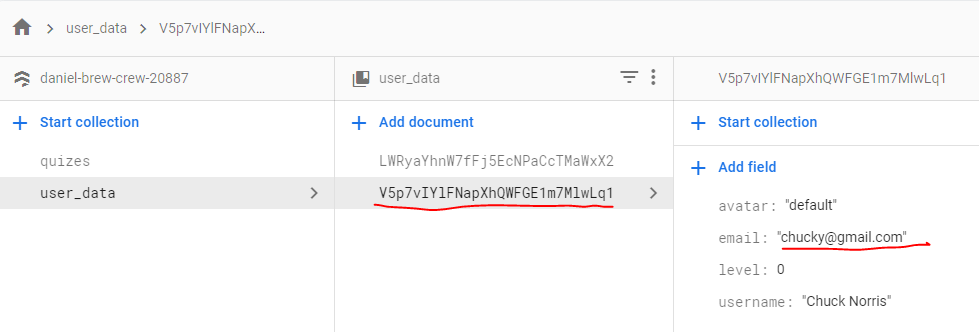
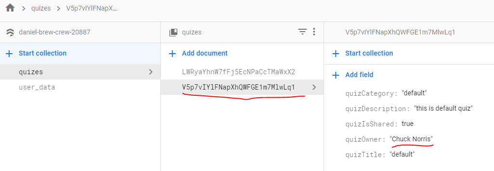
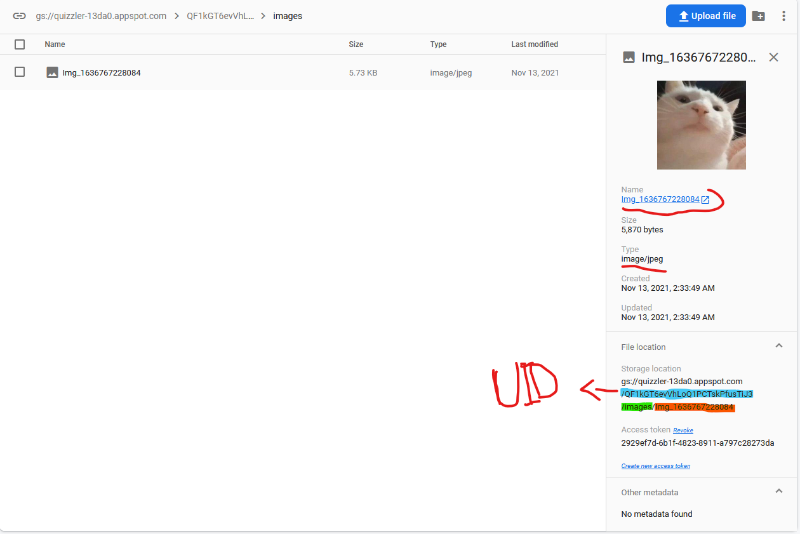
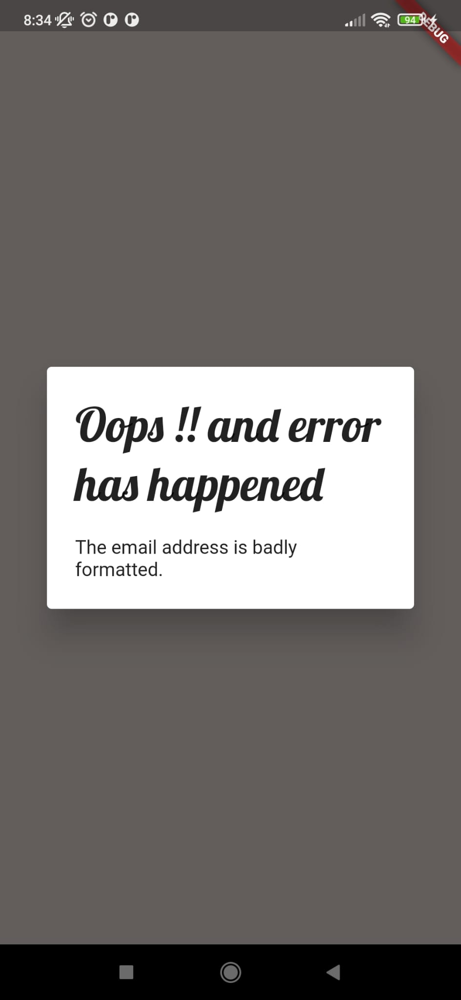

# Quiz_project

A new team project using Flutter.


# ScreenShots

### **Welcoming page, Login page and Registeration page:**
----
  

### **When a User registers/ is added to firebase:**
--------------------


### **When a Quiz is added to firebase:**
--------------------


### **When a User uploads an image to FireBase Storage:**
--------------------


### **Error Handling using Alert Boxes:**


# Implementd
- welcoming screen, login screen, register screen (functional)\ 
- "register" and "login" buttons and their functionality are implemented\
- firebase authentication and registeration are implementd (problem: only with email and password)\
- custom reusable Widgets\
- user profile to welcome registered users
- side menu with multiple functions
- the user and the user info get added to a collection in firebase
- upload Image to firebase
- User class
- Add User class
- Creating Quizzes
...\
..\
.
# TODOs
### Ideas:
- implement or integrate a home screen in the "HomeScreen.dart"(medium)\
- implement a class "TemporarySession.dart" to make player able to join a live game (hard)\
- implement a way to join live quizzes without logging in
...\
..\
.

# How to run
1- In your terminal go to the project using:
```
cd '.../$projectPath'
```
2- Then get all dependancies:
  
```
flutter pub get
```
3- Run it using:
```
flutter run
```
