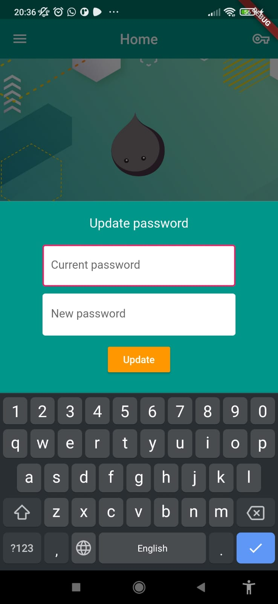
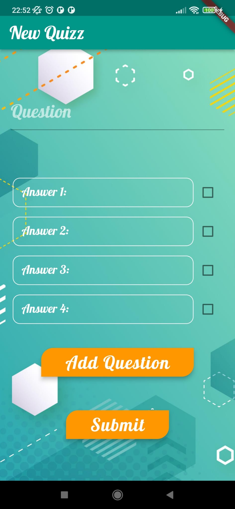
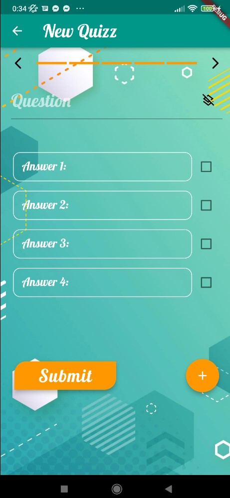
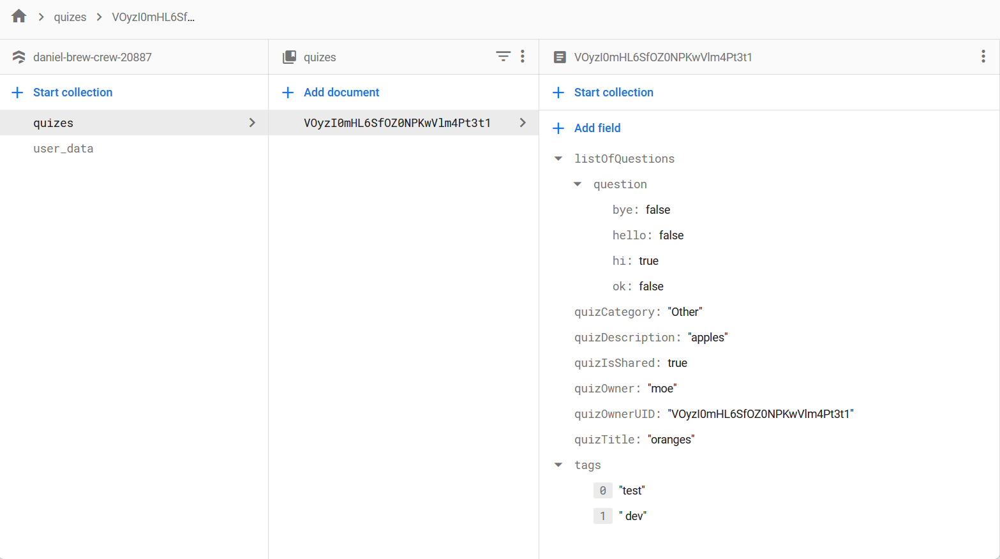

# Quiz_project

A new team project using Flutter.


# ScreenShots

### **Welcoming page, Login page and Registeration page:**
----
  

### **Profile page (home screen when logged in):**
---
 

### **When a User registers/ is added to firebase:**
--------------------


### **When a Quiz is added to firebase:**
--------------------


### **When a User uploads an image to FireBase Storage:**
--------------------


### **Error Handling using Alert Boxes:**


### **Creating New Quizz:**
  

# How to run
1- In your terminal go to the project using:
```
cd '.../$projectPath'
```
2- Then get all dependancies:
  
```
flutter pub get
```
3- Run it using:
```
flutter run
```
