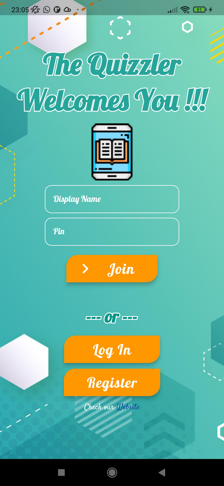

# ScreenShots

# Implementd
-welcoming screen, login screen, register screen (functional)\
-"register" and "login" buttons and their functionality are implemented\
-firebase authentication and registeration are implementd (problem: only with email and password)\
-custom reusable Widgets\
...\
..\
.
# TODOs
-implement or integrate a home screen in the "HomeScreen.dart"(medium)\
-implement functionality to the button "Join" (easy)\
-implement a class "TemporarySession.dart" to make player able to join a live game (hard)\
-implement "quizzes.dart" (hard)\
...\
..\
.